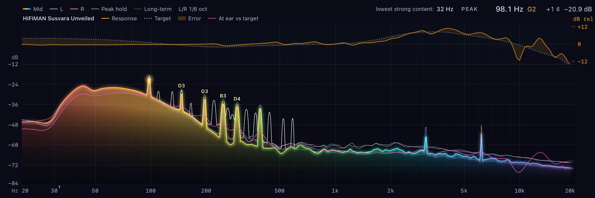
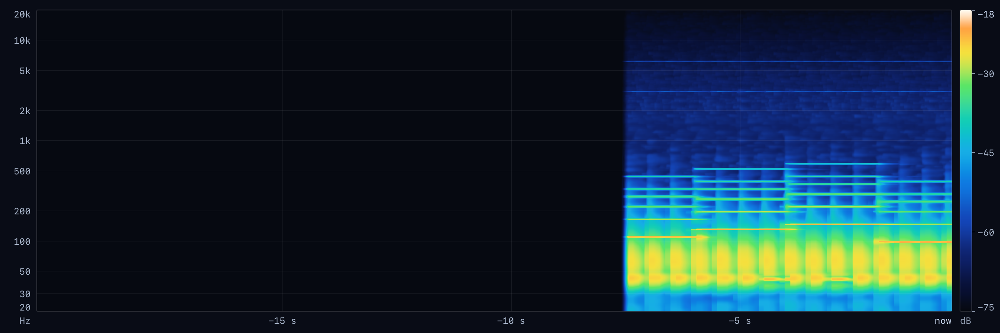
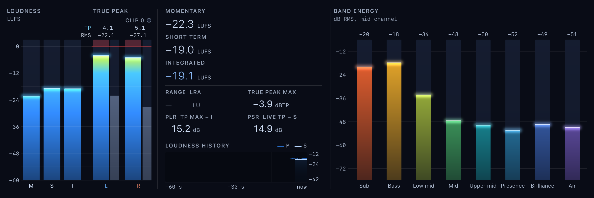

# Joseon

Real-time audio analyzer for macOS on Apple silicon. Joseon reads the audio that the Mac plays
(Qobuz first, any app works) and shows what is in the music and what the headphones must deliver.

- High-resolution log spectrum (multi-resolution FFT), peak hold, long-term average
- Scrolling spectrogram
- Loudness: LUFS momentary / short-term / integrated, loudness range, true peak, PLR, clip count
- Stereo field: vectorscope, phase correlation, balance and correlation per band
- Peak note readout, stream facts (sample rate, device), band energy
- Headphone overlay: measured response (AutoEQ data) and predicted at-ear spectrum, stress flags
- Menu bar mini spectrum

Capture uses a Core Audio process tap (macOS 14.4+). No driver. Audio stays on the Mac and is never recorded.

## Screenshots

Offscreen renders from the real analysis pipeline (`joseon-probe render`, demo signal, HiFiMAN Susvara Unveiled overlay).





## Build

```bash
swift build && swift test
```

```bash
scripts/bundle.sh --install
```

## Layout (DLMA)

| Module | Layer | Job |
|---|---|---|
| `JoseonCore` | L0 | Contracts (`Contracts.swift`), ring buffer, DSP analyzers, `AnalysisEngine` |
| `JoseonCapture` | L1 | `SystemAudioTap`: process tap to ring buffer |
| `JoseonHeadphones` | L1 | AutoEQ curve parse, library, `HeadphoneModel` |
| `JoseonRender` | L2 | Metal panels, menu bar mini renderer, offscreen PNG renderer |
| `JoseonApp` | L3 | Windows, status item, settings |
| `JoseonProbe` | tool | Headless capture + analysis to JSON, offscreen panel renders |

Modules talk only through `Sources/JoseonCore/Contracts.swift` and `Sources/JoseonRender/RenderContracts.swift`.

## License

Joseon is free software under the [GNU General Public License v3](LICENSE). Third-party data
(AutoEq headphone measurements, MIT) and trademark notes: see [NOTICE](NOTICE). The name "Joseon"
and the app icon are not covered by the GPL. Contributions: see [CONTRIBUTING.md](CONTRIBUTING.md).
